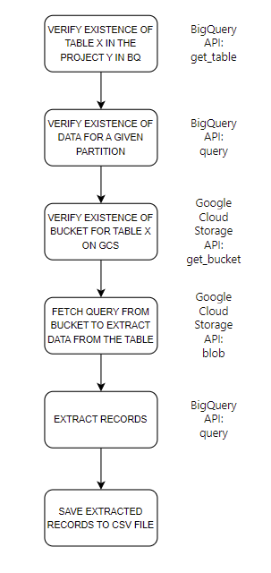

# Python API for Google Cloud

Simple project to interact with Google Cloud services through Python Apis
The aim's project is to verify the existance of a Table in BQ and a bucket in GCS
(where a query is stored in) and to use the query to extract record and save them in
CSV files.

# Flowchart
