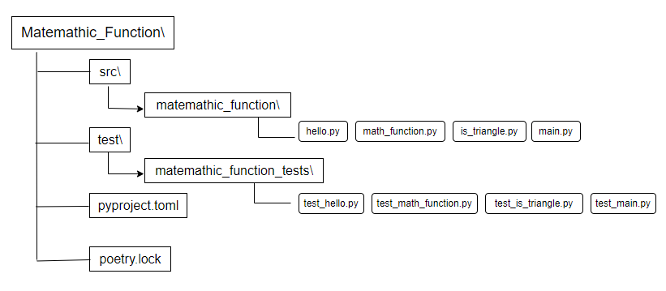

# Interactive Calculation of Triangle Metrics

Simple poetry project to calculate area and perimeter of triangles in interactive way.




```python
#Run main
poetry run python src/matemathic_function/main.py

#Run test
poetry run coverage run -m unittest discover test/matemathic_function_tests/
poetry run coverage report
```

