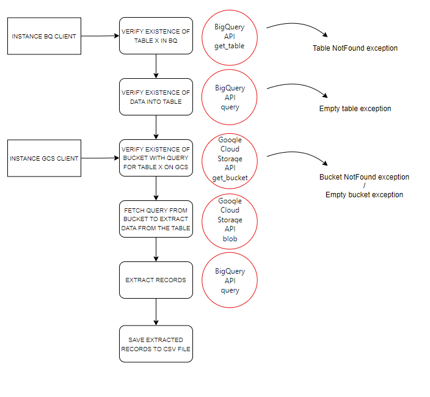
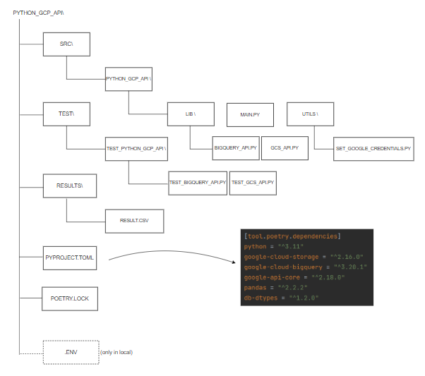

# Python APIs for GCP

## Index

- [Description](#description)
- [FlowChart](#flowchart)
- [Repo architecture](#repo-architecture)
- [Prerequisites](#prerequisites)

## Description
Simple python poetry project to interact with Google Cloud services through Python Apis.
The aim's project is to verify the existance of a Table in BQ and a bucket in GCS, 
where a query is stored in. Then the query will be use to extract record from table and save them in
CSV file. 

## Flowchart



## Repo Architecture



## Prerequisites

### Poetry

To install poetry follow the instruction on
[poetry installation](https://python-poetry.org/docs/).

After the installation, to create a new project run the following command:
``` bash
poetry new <project-name>
```
This will create a new directory with code and tests packages and a .toml file.
In the .toml file will be add all the project's dependencies.
To add dependecies run the following command:
``` bash
poetry add <dependency-name>
```
To install the defined dependencies for your project run the following command:
``` bash
poetry install
```
For more detailed instruction visit [poetry doc](https://python-poetry.org/docs/basic-usage/)

### Google Cloud Service Account

To interact with Google Cloud services such as BigQuery or Cloud Storage through Python API, you should have
a service account with the right roles for a given gcp project. For more information visit 
[service-account](https://cloud.google.com/docs/authentication#service-accounts). For the purpose of this project, a 
service account with the predefined roles of *BigQuery Data Viewer (roles/bigquery.dataViewer)*, 
*BigQuery Job User (roles/bigquery.jobUser)* and *Storage Object Viewer (roles/storage.objectViewer)* was used. 
After creating the service account, you should create an identification key (json format) to keep in a safe place on 
your local PC. **N.B: don't store the key in github repo**

Next step is to set the environment variable GOOGLE_APPLICATION_CREDENTIALS = \path\to\your\key\file.json . These 
credentials allow to Google Cloud client libraries to authenticate them and to use GCP services. In this project, it 
has been done with the *set_google_credentials* function. Also, for unit tests the python-dotenv library and an .env 
file with the GOOGLE_APPLICATION_CREDENTIALS in it has been used to test code.

If you don't want to use service account (**not best practise**), you can authenticate with OAuth 2.0 to access cloud.
In this case run the following command (required google-cloud-sdk https://cloud.google.com/sdk/docs/install):
``` bash
gcloud auth application-default login
```
This opens a browser window where you can log in with your Google account. After granting the necessary permissions, 
Google will generate an access token that will be used by Google Cloud client libraries to authenticate your requests.

